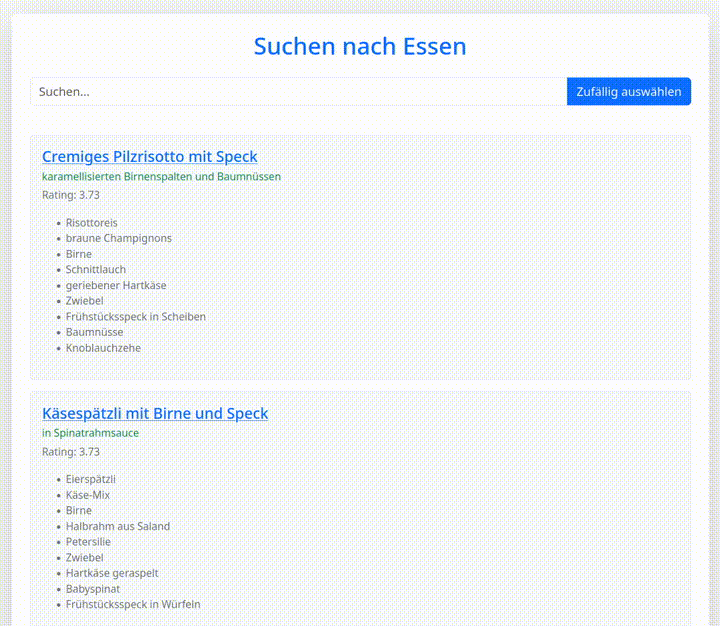

# Recipe Search

<p align="center">
    
</p>

Ever need to find recipes that use a certain ingredient in your personal collection? Ever need help choosing what to cook?

## Run it locally (dev environment)

Prepare the data:

- Put `search_data.json` (see [Data format](#data-format)) under `/src`.
- Put all the recipe files referenced from the index under `/public/recipes`.

To start the app:

```shell
npm run dev
```

To run unit tests:

```shell
npm run test
```

## Data format

```json
{
  "recipe name": {
    "name": "recipe name", // has to match the key
    "headline": "",
    "file": "path relative to recipes directory",
    "rating": 0.0,
    "calories": 543,
    "ingredients": [
      {
        "name": "",
        "quantity": ""
      }
    ]
  }
}
```

I'm not sharing my data files or the tools I used to produce them, but popular AI assistants can help you with both. Good luck!

## Deployment

Build:

```shell
npm run build
```

Then deploy the files from `dist` to a webserver like Caddy or nginx, or a static file hosting of your choice.

## Caveats and limitations

- Backendless design without precomputed index maximizes simplicity, but performance problems are expected at as low as a few thousands of recipes. Only intended for small manually curated personal collections.
